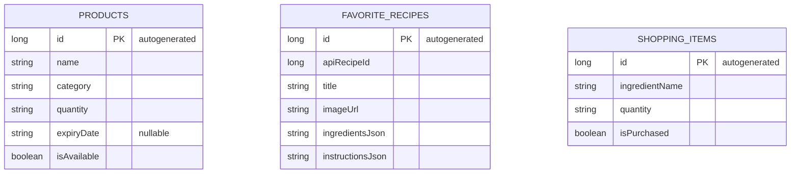

# Схема базы данных

## ER-диаграмма



## Таблицы

### products
| Колонка     | Тип       | Описание                |
|-------------|-----------|-------------------------|
| id          | LONG (PK) | Автоинкремент           |
| name        | TEXT      | Название продукта       |
| category    | TEXT      | Категория               |
| quantity    | TEXT      | Количество              |
| expiryDate  | TEXT      | Срок годности (nullable)|
| isAvailable | INTEGER   | Доступность (boolean)   |

### favorite_recipes
| Колонка        | Тип       | Описание                   |
|----------------|-----------|----------------------------|
| id             | LONG (PK) | Автоинкремент              |
| apiRecipeId    | LONG      | ID рецепта из Spoonacular  |
| title          | TEXT      | Название рецепта           |
| imageUrl       | TEXT      | URL изображения            |
| ingredientsJson| TEXT      | Ингредиенты в JSON         |
| instructionsJson| TEXT     | Инструкция в JSON          |

### shopping_items
| Колонка       | Тип       | Описание                  |
|---------------|-----------|---------------------------|
| id            | LONG (PK) | Автоинкремент             |
| ingredientName| TEXT      | Название ингредиента      |
| quantity      | TEXT      | Количество                |
| isPurchased   | INTEGER   | Куплено ли (boolean)      |

## SQL создание таблиц

```sql
CREATE TABLE products (
    id INTEGER PRIMARY KEY AUTOINCREMENT,
    name TEXT NOT NULL,
    category TEXT NOT NULL DEFAULT '',
    quantity TEXT NOT NULL DEFAULT '1',
    expiryDate TEXT,
    isAvailable INTEGER NOT NULL DEFAULT 1
);

CREATE TABLE favorite_recipes (
    id INTEGER PRIMARY KEY AUTOINCREMENT,
    apiRecipeId INTEGER NOT NULL UNIQUE,
    title TEXT NOT NULL,
    imageUrl TEXT NOT NULL DEFAULT '',
    ingredientsJson TEXT NOT NULL DEFAULT '',
    instructionsJson TEXT NOT NULL DEFAULT ''
);

CREATE TABLE shopping_items (
    id INTEGER PRIMARY KEY AUTOINCREMENT,
    ingredientName TEXT NOT NULL,
    quantity TEXT NOT NULL DEFAULT '1',
    isPurchased INTEGER NOT NULL DEFAULT 0
);
```
