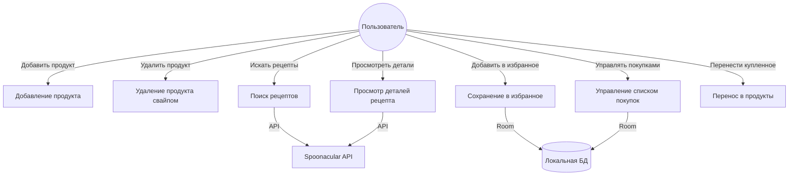

# Функциональные требования

## Основные требования (5–7)

1. **Учёт продуктов**
   — Пользователь может добавлять, просматривать и удалять продукты.
   — Удаление происходит свайпом влево (swipe-to-dismiss).

2. **Поиск рецептов**
   — Пользователь вводит запрос, приложение отправляет GET-запрос к `/recipes/complexSearch`.
   — Результаты отображаются в виде сетки карточек с изображением и названием.
   — Во время загрузки показывается индикатор.

3. **Просмотр деталей рецепта**
   — По клику на карточку открывается экран с изображением, ингредиентами и инструкцией.
   — Пользователь может добавить рецепт в избранное.
   — Недостающие ингредиенты можно добавить в список покупок.

4. **Избранные рецепты**
   — Пользователь может просматривать и удалять избранные рецепты (свайпом).
   — Данные хранятся в локальной БД (Room).

5. **Список покупок**
   — Пользователь отмечает ингредиенты как купленные (чекбокс).
   — Купленные позиции переносятся в список продуктов.

6. **Навигация**
   — Нижняя панель навигации (Bottom Navigation Bar) с 4 вкладками.
   — Переход между экранами через NavHost.

7. **Работа с API Spoonacular**
   - `GET /recipes/complexSearch?query={query}&apiKey={key}&number=20`
   - `GET /recipes/{id}/information?apiKey={key}`
   - Ключ хранится в `local.properties` и не коммитится.

## Use Case диаграмма

## Сценарии использования

### Сценарий 1: Добавление продукта
1. Пользователь открывает вкладку «Мои продукты».
2. Нажимает FAB («+»).
3. Вводит название, категорию, количество, срок годности.
4. Нажимает «Добавить».
5. Продукт появляется в списке.

### Сценарий 2: Поиск и сохранение рецепта
1. Пользователь открывает вкладку «Поиск рецептов».
2. Вводит «борщ» в строку поиска.
3. Видит подсказки из своих продуктов.
4. Нажимает кнопку поиска.
5. Получает сетку результатов.
6. Нажимает на карточку «Борщ».
7. На экране деталей нажимает «В избранное».
8. Переходит во вкладку «Избранное» — рецепт сохранён.

### Сценарий 3: Список покупок
1. Пользователь открывает детали рецепта.
2. Приложение показывает недостающие ингредиенты.
3. Пользователь нажимает «В список покупок».
4. Переходит во вкладку «Список покупок».
5. Отмечает купленные ингредиенты чекбоксом.
6. Нажимает «Перенести купленное в продукты».
7. Купленные ингредиенты появляются в «Мои продукты».
